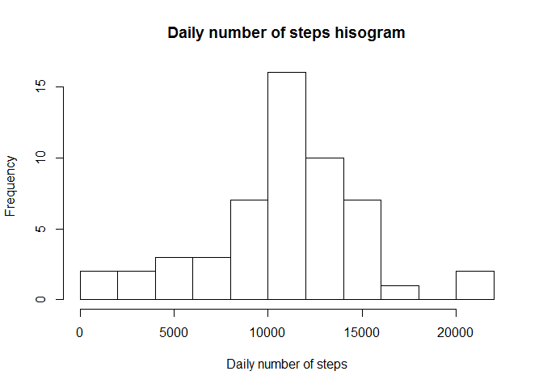
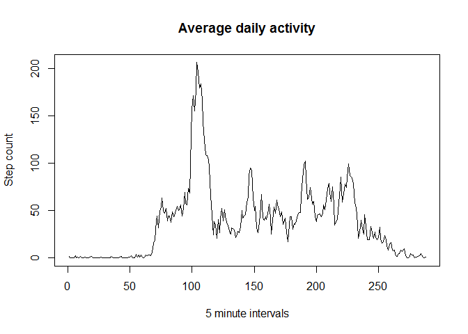
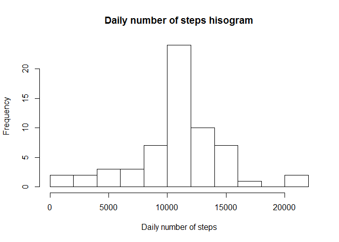
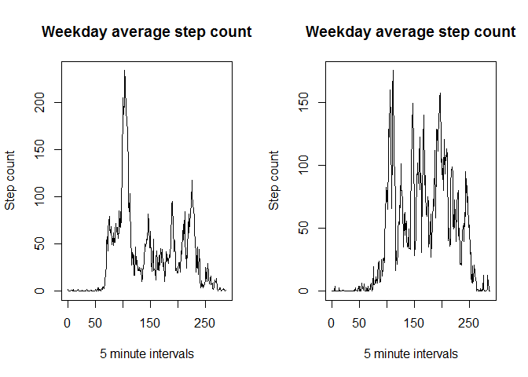

## Loading and preprocessing the data

At this point, the data is loaded by using **read.csv()**, and the columns are converted to their respective classes at load-time. No further preprocessing is necessary.

```r
df <- read.csv("activity.csv", colClasses=c("numeric","Date","numeric"))
```

## What is mean total number of steps taken per day?

The total number of steps taken per day is computed and partially shown below:

```r
df_by_day <- aggregate(df$steps, by=list(df$date), sum)
head(df_by_day)
```

```
##      Group.1     x
## 1 2012-10-01    NA
## 2 2012-10-02   126
## 3 2012-10-03 11352
## 4 2012-10-04 12116
## 5 2012-10-05 13294
## 6 2012-10-06 15420
```

## What is the average daily activity pattern?

A histogram of the number of days with respect to the step number is shown below:

```r
hist(df_by_day$x,10, xlab="Daily number of steps", main="Daily number of steps hisogram")
```

<!-- -->

The mean daily activity is shown below:

```r
mean(df_by_day$x,na.rm=TRUE)
```

```
## [1] 10766.19
```

The median daily activity is shown below:

```r
median(df_by_day$x,na.rm=TRUE)
```

```
## [1] 10765
```

A line plot of the average daily activity pattern is shown below as a function of the 5-minute interval (288 in the span of 24 hours):

```r
df_mat <- matrix(data = df$steps, nrow = 288, ncol = 61)
plot(rowMeans(df_mat, na.rm=TRUE), type='l', xlab="5 minute intervals", main="Average daily activity", ylab="Step count")
```

<!-- -->

The computation for the maximum number of steps within a day is shown below:

```r
tmp <- which.max(rowMeans(df_mat, na.rm=TRUE))*5
minutes_max <- tmp %% 60
hours_max <- (tmp-minutes_max)/60
paste("Maximum number of steps at ",hours_max,":",minutes_max-5,sep="")
```

```
## [1] "Maximum number of steps at 8:35"
```

## Imputing missing values

The number of missing values is computed below:

```r
sum(is.na(df['steps']))
```

```
## [1] 2304
```

The strategy devised for handling the NA values in the dataset is by replacing their values with the corresponding time interval's mean value over the non-missing values. Below, the mean daily step counts and NA indices are computed:

```r
mean_data <- rep(rowMeans(df_mat, na.rm=TRUE), 8)
indices_with_na <- which(is.na(df['steps']))
```

Below, a new dataset is generated with NA values replaces by the mean daily step counts:

```r
df['stepscleaned'] <- df$steps

for (naidx in 1:length(indices_with_na)){
    df$stepscleaned[indices_with_na[naidx]] <- mean_data[naidx]
}
```

A histogram shows the results of data cleaning below:

```r
df_by_day_cleaned <- aggregate(df$stepscleaned, by=list(df$date), sum)

hist(df_by_day_cleaned$x,10, xlab="Daily number of steps", main="Daily number of steps hisogram")
```

<!-- -->

No change is observed in the mean with respect to the uncorrected data:

```r
mean(df_by_day_cleaned$x,na.rm=TRUE)
```

```
## [1] 10766.19
```

Negligeble change is observed in the median with respect to the uncorrected data:

```r
median(df_by_day_cleaned$x,na.rm=TRUE)
```

```
## [1] 10766.19
```


## Are there differences in activity patterns between weekdays and weekends?

A **dayofweek** column has been added to the original dataset, with possible values of **weekday** and **weekend**:

```r
df['dayofweek'] <- as.factor(ifelse(weekdays(df$date) %in% c("Saturday", "Sunday"), "weekend", "weekday"))
```

The resulting plots of the average daily step counts for weekdays and weekends are shown below:

```r
df_mat_wd <- matrix(data = subset(df,df$dayofweek=="weekday")$steps, nrow = 288, ncol = nrow(subset(df,df$dayofweek=="weekday"))/288)
df_mat_we <- matrix(data = subset(df,df$dayofweek=="weekend")$steps, nrow = 288, ncol = nrow(subset(df,df$dayofweek=="weekend"))/288)
par(mfrow=c(1,2))
plot(rowMeans(df_mat_wd, na.rm=TRUE), type='l', xlab="5 minute intervals", main="Weekday average step count",ylab="Step count")
plot(rowMeans(df_mat_we, na.rm=TRUE), type='l', xlab="5 minute intervals", main="Weekday average step count", ylab="Step count")
```

<!-- -->
